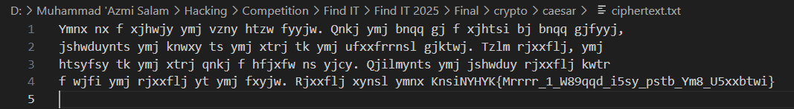
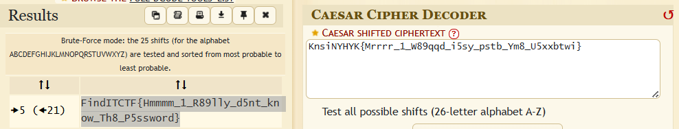

# Soal caesar chiper #
# 
> 

# Deskripsi #

Diberikan sebuah file berisi chipertext, dimana saya perlu mendeskripsikan chipertext tersebut untuk mendapatkan flagnya.


# Analisis #

Setelah dianalisis, untuk mendapatkan flag nya saya cukup meng copy bagian akhirnya saja karena sudah terlihat jelas itu sesuai dengan format flagnya.

# Solusi #

Setelah mengcopy bagian akhir dari chipertext tersebut, kemudian saya men decrypt text tersebut menggunakan tools pada web https://www.dcode.fr/caesar-cipher dan dari sana saya bisa mendapatkan flagnya.


# Flag #
```Flag
FindITCTF{Hmmmm_1_R89lly_d5nt_know_Th8_P5ssword}
````
