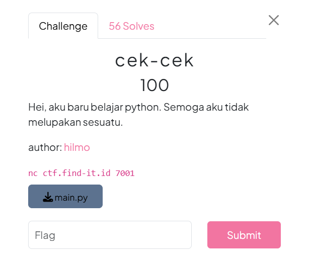
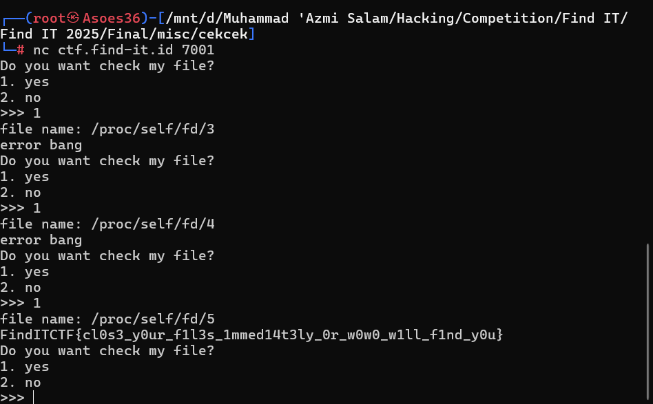

# Soal cek-cek #


# Deskripsi #

Diberikan attachment file main.py

# Analisis #

Untuk mendapatkan flagnya kita bisa membuka file flag.txt nya saja di direktori yang sama, ini mirip mirip seperti soal your-jouney-2, namun bedanya disini kata flag dan karakter . itu diblokir jadi kita tidak bisa menggunakan cara yang tadi. Selain itu, jika kita memilih opsi 2, kita akan diberikan flag nya tapi yang sudah dienkripsi dalam bentuk hash.

# Solusi #

Sebelum melakukan analisis pada hashnya, saya mencoba cara yang lebih sederhana terlebih dahulu, yaitu membuka file-file yang ada di direktori tersebut dengan query **/proc/self/fd/** siapa tau flagnya akan bisa langsung didapatkan dengan cara itu, dan setelah 5 kali percobaan ternyata saya bisa langsung mendapatkan flagnya (hoki menn pake ilmu dukun).


# Flag #
```Flag
FindITCTF{cl0s3_y0ur_f1l3s_1mmed14t3ly_0r_w0w0_w1ll_f1nd_y0u}
````
