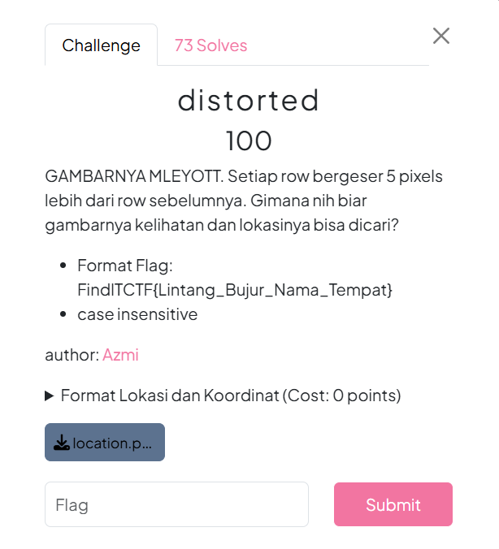
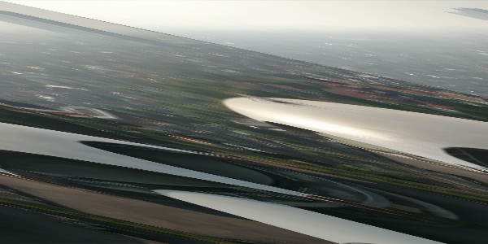

# Soal disorted #


# Deskripsi #

Diberikan sebuah file berisi chipertext, dimana saya perlu mendeskripsikan chipertext tersebut untuk mendapatkan flagnya.


# Analisis #

Untuk melakukan analisis lebih lanjut tentunya kita perlu memperbaiki foto tersebut agar kembali menjadi normal. Setelah itu, kita bisa lanjut melakukan pencarian dimana lokasi itu berada dan kita perlu mendapatkan titik koordinat dan nama tempatnya, kemudian menuliskannya sesuai format flag.
# Solusi #

Untuk memperbaiki foto yang sudah didistorsi, kita bisa menggunakan script python seperti ini.
```
from PIL import Image
import numpy as np


img = Image.open("location.png")
pixels = np.array(img)


height, width, _ = pixels.shape


for i in range(height):
    shift = (i * 5) % width
    pixels[i] = np.roll(pixels[i], -shift, axis=0)


fixed_img = Image.fromarray(pixels)
fixed_img.save("fixed_image.png")
fixed_img.show()
```
setelah itu, foto yang ditampilkan akan seperti ini.


Kita bisa langsung mendapatkan lokasi tempat tersebut menggunakan google lens, kemudian diketahuilah bahwa tempat tersebut berlokasi di Gereja Bethany Nginden. Setelah itu, saya menggunakan google maps untuk mengetahui titik koordinatnya dan didapatkanlah -7.306955671262183, 112.77254941881688 tapi sesuai formatnya kita hanya perlu mengambil 4 angka dibelakang koma dan nama lokasinya sesuai yang tertera di google (case sensitive). Maka dari sana kita sudah bisa mendapatkan flagnya.

# Flag #
```Flag
FindITCTF{-7.3069_112.7725_Gereja_Bethany_Nginden}
````
