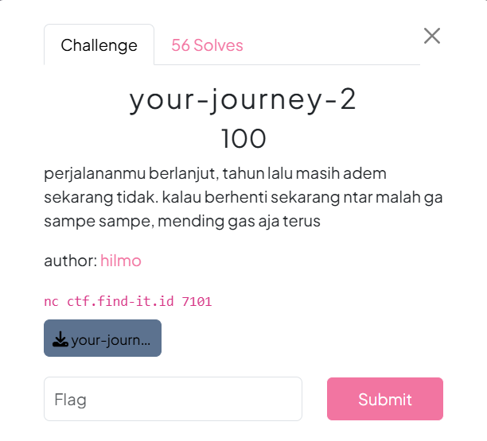
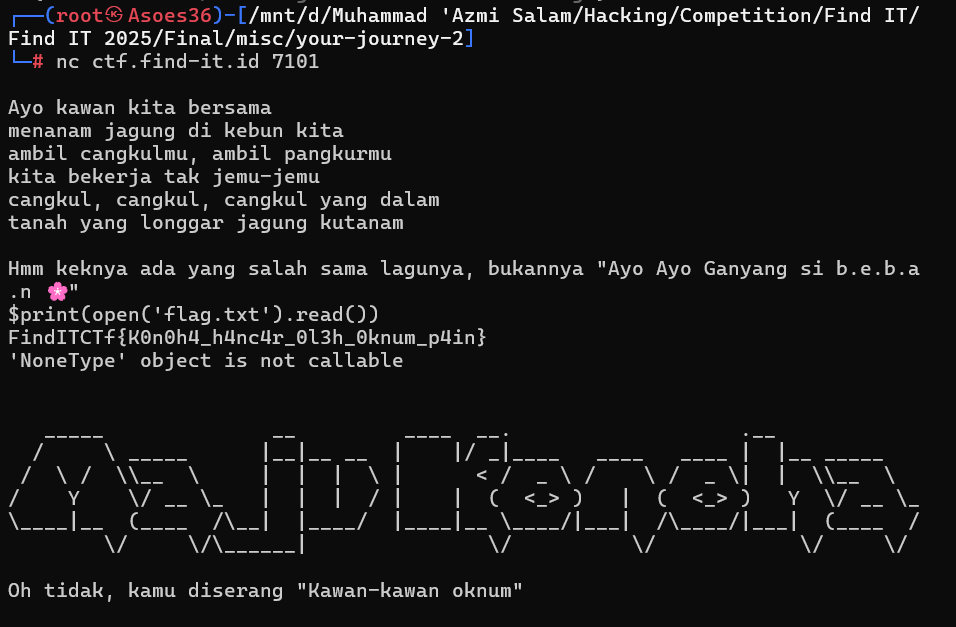
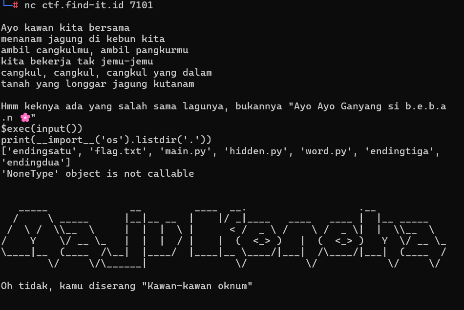
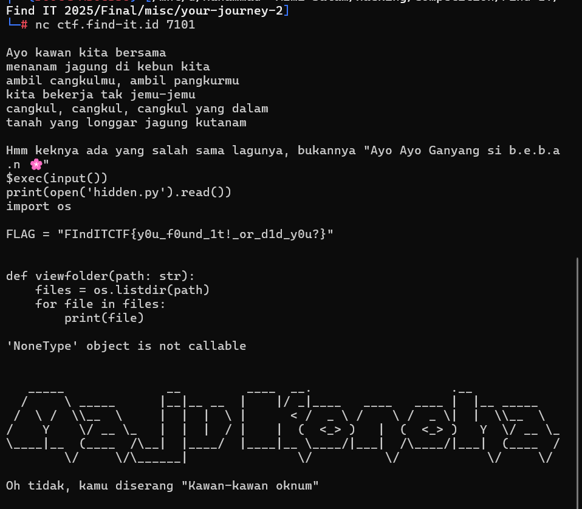
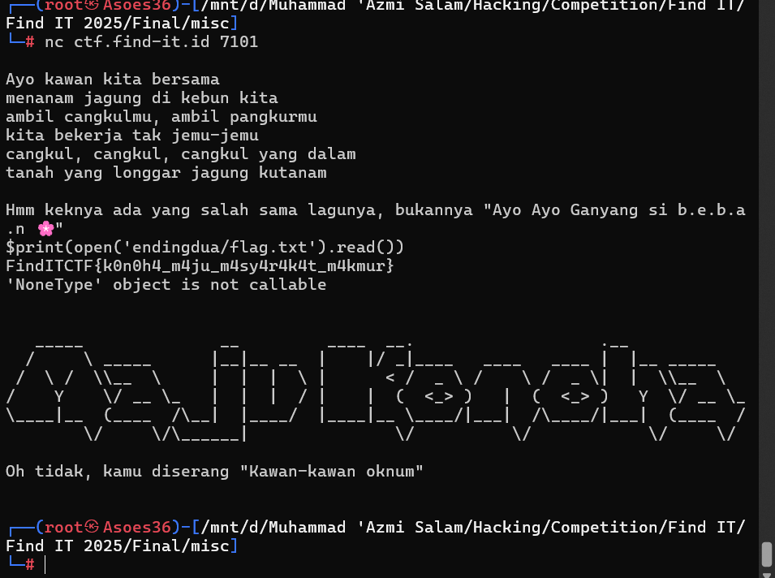

# Soal your-journey-2 #



# Deskripsi #

Diberikan attachment yang berisi main.py dan word.py, yang berisi alur program dan query yang akan diblokir.

# Analisis #

Kita bisa mendapatkan flagnya dengan membuka file yang berada di direktori yang sama. Namun, untuk melakukan itu kita perlu menggunakan query import, tapi import adalah salah satu kata yang diblokir. Jadi, kita perlu memikirkan cara agar pemblokiran kata itu bisa di bypass.

# Solusi #

Sebelum mencari cara untuk melakukan bypass, sebenarnya kita dapat melakukan educated guess, dalam beberapa soal CTF kebanyakan flag itu disimpan dalam file bernama flag.txt yang kebetulan dari kata flag.txt itu tidak ada kata yang bisa diblokir. Maka pada saat itu langkah pertama yang saya lakukan adalah menggunakan query ini



di sana kita dapat melihat flag, akan tetapi pada saat saya submit flagnya, jawaban saya ter verdict incorrect, dan setelah saya fokus baca baca lagi flagnya, ternyata memang benar, pada FindITCTf itu f nya non-kapital, yang mana itu tidak sesuai format. Maka dari sana saya berasumsi kalau itu adalah fake flag. Setelah itu, saya melakukan cara lain tadi yaitu dengan melakukan bypass agar tidak diblokir, saya menggunakan query exec(input()) untuk melakukan bypass dan saya melakukan import os untuk melihat di direktori ini ada file apa saja.



di sana ada file hidden.py, awalnya saya kira flagnya akan disimpan disana dan ketika saya coba untuk print, begini hasilnya.



dan setelah saya baca itu penulisan flagnya tidak sesuai format, maka saya anggap itu fake flag lagi. Di sini saya berasumsi bahwa akan ada banyak fake flag, maka saya harus mengandalkan ilmu dukun untuk mempercepat proses pencarian flag.

Dapat kita lihat di direktori tadi ada 3 folder yang bernama ‘endingsatu’, ‘endingdua’, dan ‘endingtiga’. awalnya saya sempat berasumsi bahwa flagnya akan terpotong-potong, tapi saya pun mencoba membuka file yang ada di ‘endingdua’ terlebih dahulu (karena feeling saja).



dan ternyata sudah ada flag utuh dengan format yang benar pula. Maka saya langsung submit flag tersebut dan mendapatkan verdict correct.

# Flag #
```Flag
FindITCTF{k0n0h4_m4ju_m4sy4r4k4t_m4kmur}
````
