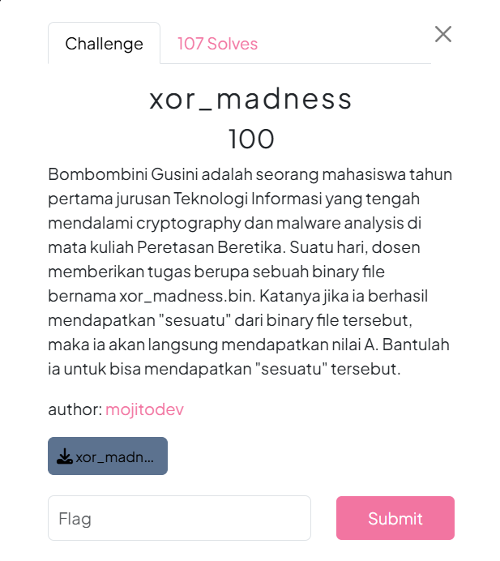
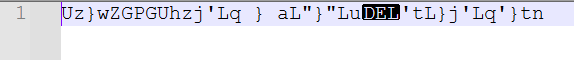
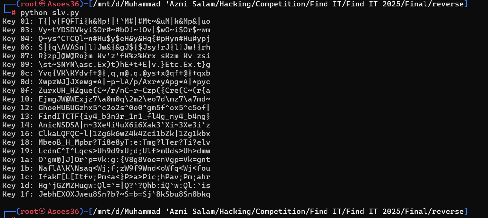

# Soal xor_madness #


# Deskripsi #

Diberikan attachment berupa file binary yang tidak bisa dibaca semua langsung, kalau dibuka di notepad++ akan jadi seperti ini.



# Analisis #

Karakter DEL itu dapat kita ubah menjadi hexadesimal x7f karena itu memiliki nilai ASCII 127. Setelah itu, kita dapat me reverse text tersebut menggunakan mesin bruteforce yang sudah saya buat.

# Solusi #

Masukan text hexadesimal tersebut ke dalam script, kemudian jalankan scriptnya, darisana kita bisa mendapatkan flagnya.

```
cipher = b"Uz}wZGPGUhzj'Lq } aL\"}\"Lu\x7f'tL}j'Lq'}tn"

for key in range(256):
    plain = ''.join(chr(c ^ key) for c in cipher)
    if all(32 <= ord(c) <= 126 for c in plain):
        print(f"Key {key:02x}: {plain}")
```



# Flag #
```
FindITCTF{iy4_b3n3r_1n1_fl4g_ny4_b4ng}
````
