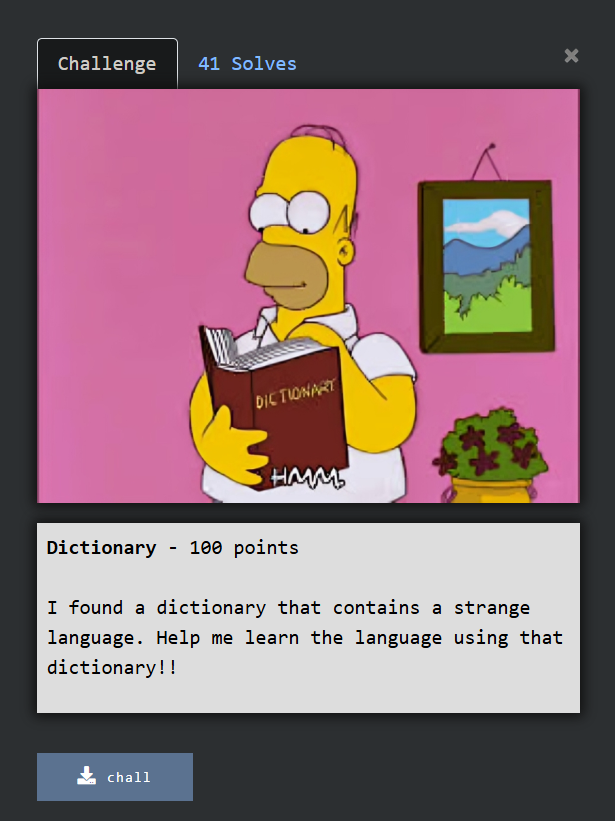

# Soal Dictionary #


# Deskripsi #

Diberikan attachment berupa file chall yang katanya punya bahasa aneh dan kita perlu membuat kamus untuk memecahkan masalahnya.

# Solusi #

Setelah melakukan analisis, rupanya kita dapat bebas melakukan input char atau string ketika menjalankan file itu, lalu file akan memberikan hasil translasi dari string yang kita masukan.

Dari situ kita dapat melihat kerentanannya, bahwa kita bisa melakukan bruteforce dengan memasukan semua char yang printable lalu menyimpannya sebagai kamus, dan kita tinggal menukar mapping tersebut agar nanti bisa digunakan sebagai decryptor flagnya.

```
from pwn import *
context.log_level = 'error'

# save printable ASCII
charset = [chr(i) for i in range(32, 127)]
mapping = {}

# make dictionary (encrypt)
for ch in charset:
    # process file
    io = process("./chall")

    # send char to machine
    for _ in range(5): io.recvline()
    io.recvuntil(b"\xf0\x9f\x93\x9d > ")
    io.sendline(ch.encode())

    # get the result
    translated = None
    for _ in range(6):
        line = io.recvline().decode(errors='ignore').strip()
        if line.startswith("Translated: "):
            translated = line.split("Translated: ")[-1]
            break

    # close the process
    io.close()

    if translated: mapping[ch] = translated
    else: print(f"[!] No translation for char {ch!r}")

# reverse dictionary
rev_map = {}
for i, j in mapping.items(): rev_map[j] = i
# rev_map = {j : i for i, j in mapping.items()}

# start decrypt process
str = "80@Q(vMpf?fJt?]nNvfnv?fJt?(~fPu~xv?fJt?!lnilHf~pe?iH?Pvi?izJ?#hMxX"
flag = ""
for c in str:
    if c in rev_map: flag += rev_map[c] # save to the flag
    else: flag += "?" # doesnt found

# print flag
print(flag)
```

# Flag #
```
ACE{Le4rn_n3w_Sc1ence_n3w_Lan9uage_n3w_Dicti0nary_t0_9et_th3_Fl4g}
````
